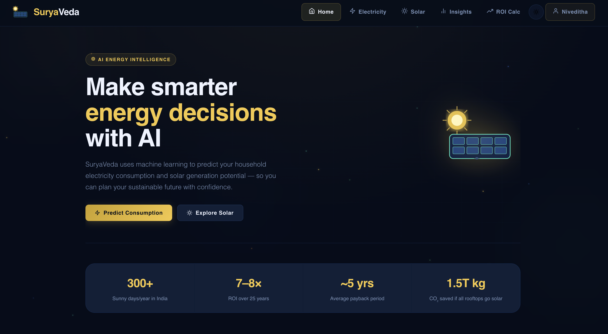
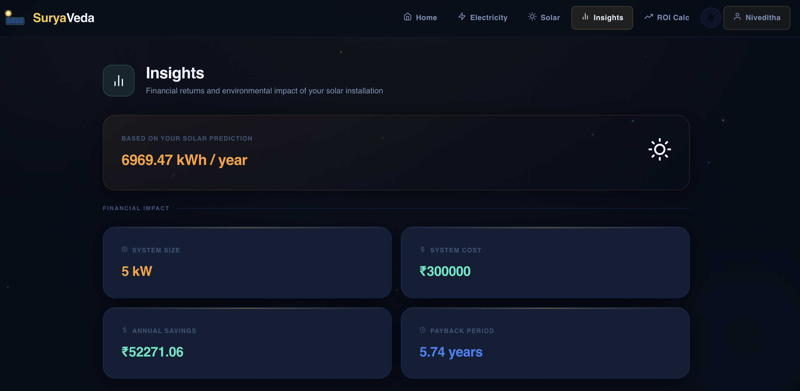
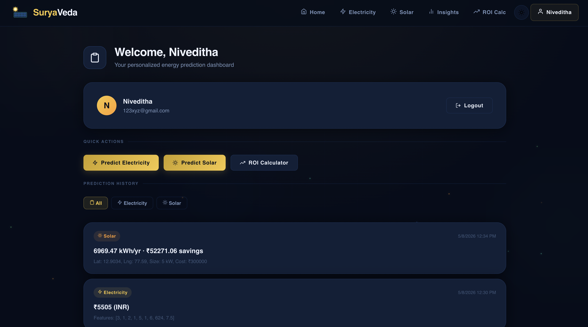

# SuryaVeda ☀️

**AI-powered energy analytics platform** for predicting household electricity consumption and solar energy generation potential — empowering smarter, sustainable energy decisions for Indian households.

---

## Features

- **Electricity Consumption Prediction** — Enter appliance counts, usage hours, and tariff rate to get monthly kWh & bill estimates (XGBoost model with formula-based fallback for low-usage households)
- **Solar Generation Prediction** — Input location coordinates, cloud coverage, system size, cost per kW, and geographic zone for annual solar output estimates (Gradient Boosting model)
- **Auto-Detect Location** — One-click geolocation + Open-Meteo API for automatic latitude, longitude, and cloud coverage fill
- **Insights Dashboard** — Financial returns (annual savings, payback period) and environmental impact (CO₂ reduction, trees equivalent)
- **ROI / Payback Calculator** — Year-by-year investment breakdown with inflation, degradation, and maintenance factored in
- **User Authentication** — JWT-based signup/login with personalized prediction history stored in SQLite
- **Dark / Light Theme** — Toggle between themes with preference persistence
- **Animated UI** — Floating particles, gradient orbs, animated counters, toast notifications, skeleton loaders

---

## Tech Stack

| Layer | Technology |
|-------|-----------|
| Frontend | React 19, React Router 6, React Icons (Feather + Tabler) |
| Backend | Flask (Python), Flask-CORS |
| ML Models | XGBoost (electricity), scikit-learn Gradient Boosting (solar) |
| Database | SQLite (users + prediction history) |
| Auth | JWT (PyJWT) + bcrypt password hashing |
| APIs | Open-Meteo (weather data for auto-detect) |

---

## Project Structure

```
React-App/
├── frontend/
│   ├── src/
│   │   ├── components/       # Reusable UI components
│   │   │   ├── common/       # InputField, ResultCard, Toast, Skeleton, AnimatedBackground
│   │   │   ├── layout/       # Navbar
│   │   │   └── index.js      # Barrel exports
│   │   ├── context/          # React contexts
│   │   │   ├── AppContext.js  # Shared state (solar results, tariff, toasts)
│   │   │   ├── AuthContext.js # Auth state (user, token, login/signup/logout)
│   │   │   └── ThemeContext.js# Dark/light theme toggle
│   │   ├── pages/            # Route pages
│   │   │   ├── Home.jsx
│   │   │   ├── Electricity.jsx
│   │   │   ├── Solar.jsx
│   │   │   ├── Insights.jsx
│   │   │   ├── Dashboard.jsx
│   │   │   ├── RoiCalculator.jsx
│   │   │   ├── Login.jsx
│   │   │   └── Signup.jsx
│   │   ├── App.js            # Root component with routes
│   │   └── App.css           # All styles (CSS variables, glass morphism)
│   └── package.json
├── backend/
│   ├── app.py                # Flask server (API + auth + ML inference)
│   ├── electricity_prediction_model.joblib
│   ├── solar_prediction_model.joblib
│   ├── solar_scaler.joblib
│   ├── suryaveda.db          # SQLite database (auto-created)
│   └── requirements.txt
├── Datasets/
│   ├── electricity_bill_dataset.csv
│   ├── Solar_dataset.csv
│   └── Solar_prediction.csv
├── SAMPLE_INPUTS.md          # Test scenarios with real-world inputs
└── README.md
```

---

## Getting Started

### Prerequisites

- **Node.js** ≥ 18
- **Python** ≥ 3.10

### Backend Setup

```bash
cd backend
python -m venv .venv

# Windows
.\.venv\Scripts\Activate.ps1

# macOS/Linux
source .venv/bin/activate

pip install -r requirements.txt
cp .env.example .env
python app.py
```

Backend runs at `http://127.0.0.1:5000`

Set a strong `SECRET_KEY` in `backend/.env` before deploying.

### Frontend Setup

```bash
cd frontend
npm install
cp .env.example .env
npm start
```

Frontend runs at `http://localhost:3000`

---

## API Endpoints

| Method | Endpoint | Auth | Description |
|--------|----------|------|-------------|
| POST | `/api/signup` | No | Create account |
| POST | `/api/login` | No | Get JWT token |
| GET | `/api/me` | Yes | Get current user info |
| GET | `/api/predictions` | Yes | Get prediction history |
| POST | `/predict_electricity` | Optional | Run electricity prediction |
| POST | `/predict_solar` | Optional | Run solar prediction |

---

## Usage

1. **Sign up** for an account at `/signup`
2. Navigate to **Electricity** — enter your appliance details and get consumption prediction
3. Navigate to **Solar** — use Auto-Detect or manually enter location and system details, then get a full-system solar generation estimate
4. View **Insights** for combined financial and environmental metrics
5. Use **ROI Calculator** to model long-term investment returns
6. Check **Dashboard** to review all your past predictions

---

## Contributors

- [Aastha](https://github.com/AasthathecoderX)
- [Niveditha](https://github.com/marvelcodeX)


---

## Demo Images
| | |
|---|---|
|  |  |
|  | |

---

## Project Evolution

This project is an enhanced version of **SuryaVeda**, an AI-powered energy analytics platform that I originally developed as part of the **Edunet Energy** program.

Building on the original implementation, this version was developed collaboratively to transform the project into a more feature-rich and production-ready application. Key enhancements include:

- Modernized React-based user interface with improved user experience
- JWT-based authentication and personalized user dashboards
- Prediction history management with SQLite
- Enhanced machine learning workflows for electricity and solar predictions
- Financial and environmental insights, including ROI and payback analysis
- Automatic location detection using the Open-Meteo API
- Improved backend architecture, API design, and project organization
- Better deployment support, documentation, and maintainability

The original repository serves as the foundation for this project, while the current version significantly expands its functionality and overall user experience.

### Original Project

**SuryaVeda (Initial Version):**  
https://github.com/AasthathecoderX/SuryaVeda